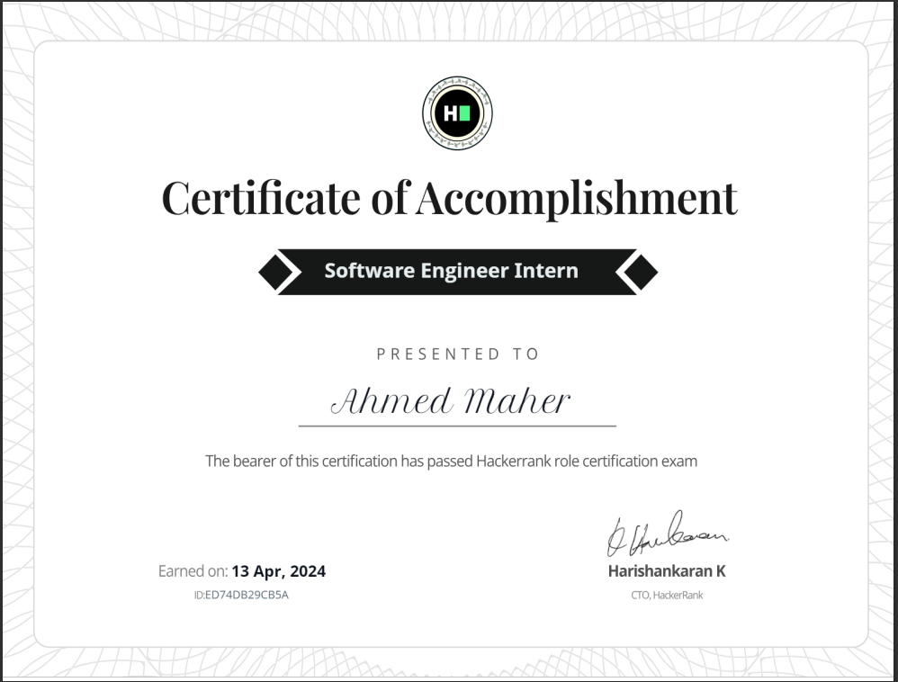

# 100-day-challenge

## Day 1
creating this repo

## Day 2 
solve problem on codeforces
  Fox And Snake problem 
  <a href="https://codeforces.com/contest/510/submission/240023330" target="_blank">link of answer</a>

  ## Day 3
work on flutter APP using firebase and API
  <a href="https://github.com/Ahmed336-cell/ecommerce_app" target="_blank">link of repo</a>
  ## Day 4
  work on quiz app with flutter implement (API, timer)
    <a href="https://github.com/Ahmed336-cell/quiz_pp" target="_blank">link of repo</a>
  ## Day 5
  make encryption and decryption code with python and Tkinter
      <a href="https://github.com/Ahmed336-cell/100-day-challenge/blob/main/encryption%2Cpy" target="_blank">link of code</a>
  ## Day 6
  solve 2 problems on leetcode 75  
 <a href="https://github.com/Ahmed336-cell/100-day-challenge/tree/main/leetcode" target="_blank">link of repo</a>

 ## Day 7
 make a Portfolio using HTML ,CSS ,js   
  <a href="https://ahmed336-cell.github.io/ahmedmaherelmo.github.io/" target="_blank">link of Portfolio</a>  
   <a href="https://github.com/Ahmed336-cell/ahmedmaherelmo.github.io" target="_blank">link of repo</a>

   ## Day 8
   solve 2 problems on leetcode 75  
   <a href="https://github.com/Ahmed336-cell/100-day-challenge/tree/main/leetcode" target="_blank">link of repo</a>

   ## Day 9
   make Spelling Checker app with python
   <a href="https://github.com/Ahmed336-cell/100-day-challenge/blob/main/Spelling%20Checker.py" target="_blank">link of repo</a>
   ## Day 10
   solve 2 problems on leetcode (easy problems)  
   <a href="https://github.com/Ahmed336-cell/100-day-challenge/tree/main/leetcode" target="_blank">link of repo</a>
   ## Day 11
   solve 1 problem on leetcode (easy problems)  
   <a href="https://github.com/Ahmed336-cell/100-day-challenge/tree/main/leetcode" target="_blank">link of repo</a>
  ## Day 12
  starting with jetpack compose android app   making a calculator
   
     <a href="https://github.com/Ahmed336-cell/100-day-challenge/tree/main/Calculator%20App/Calculator" target="_blank">link of repo</a>
   ## Day 13
   Make some changes to my Portfolio (Adding image, change the way of previewing my CV)
     <a href="https://ahmed336-cell.github.io/ahmedmaherelmo.github.io/" target="_blank">link of Portfolio</a>  

  ## Day 14
  start Prodigy infotech internship with first task ( calculator app )  
       <a href="https://github.com/Ahmed336-cell/PRODIGY_AD_01" target="_blank">link of repo</a>  
## Day 15
<h2>starting reading Grokking algorithms book and finished the first chapter</h2>
<h3>talking about</h3>
The first chapter of "Grokking Algorithms" introduces the reader to the fundamental concept of algorithms and their importance in solving problems. It emphasizes the ubiquitous nature of algorithms in our daily lives, from simple tasks to complex processes. The chapter also provides an overview of what algorithms are and how they differ from computer programs. Additionally, it introduces the concept of Big O notation, a way to analyze and compare the efficiency of algorithms in terms of their time and space complexity. Overall, the first chapter sets the stage for understanding the role and significance of algorithms in computer science and problem-solving.

## Day 16
Make transparent listview app with flutter that camera work as a background for listview  
 <a href="https://github.com/Ahmed336-cell/100-day-challenge/tree/main/trasnparent_listview" target="_blank">link of repo</a>  

https://github.com/Ahmed336-cell/100-day-challenge/assets/65620946/63c4c2f8-996d-4006-bf3d-6565573be5b5

## Day 17
Develop light bulb app with flutter that has different way to turn on/off flash light 
<a href="https://github.com/Ahmed336-cell/100-day-challenge/tree/main/flash_bulb" target="_blank">link of repo</a>  

https://github.com/Ahmed336-cell/100-day-challenge/assets/65620946/f1b79a2c-a1a5-4f27-aecc-9a95ba58a0fe

## Day 18
 second task Prodigy infotech internship ( Note app )  
       <a href="https://github.com/Ahmed336-cell/PRODIGY_AD_02" target="_blank">link of repo</a>  
 
## Day 19
<h2>Reading chapter 2 from Grokking Algorithms Book</h2>
<h3>Talking about</h3>
In this chapter, the focus is on fundamental data structures and a basic sorting algorithm. Arrays and linked lists, two essential data structures, are introduced. Arrays, already touched upon in Chapter 1, are highlighted as crucial and frequently used throughout the book. However, the chapter also emphasizes that linked lists can be more advantageous in certain situations, and it aims to provide insights into the pros and cons of both structures, enabling readers to make informed choices for their algorithms.
 
The chapter further introduces the concept of sorting algorithms, starting with the explanation of selection sort. Sorting is essential for various algorithms, including binary search, which can only be performed on a sorted list of elements. While many programming languages come with built-in sorting algorithms, the chapter presents selection sort as a foundational sorting algorithm. Additionally, it sets the stage for understanding more advanced sorting algorithms like quicksort, which will be covered in the next chapter. The understanding of selection sort is positioned as a valuable precursor to grasping quicksort, contributing to a deeper comprehension of this important algorithm.
 

## Day 20
making calculator that (add,sub,div,mul) with assembly  

<a href="https://github.com/Ahmed336-cell/100-day-challenge/blob/main/calculator.asm" target="_blank">link of code</a>  

## Day 21
Making a timer app (start, pause, reset) display time in minutes, seconds, and milliseconds is the third project in the Prodigy Info internship  
<a href="https://github.com/Ahmed336-cell/PRODIGY_AD_03" target="_blank">link of repo</a>  

## Day 22
<h2>Chapter 3 Grokking algorithms book</h2>
<h3>talking about</h3>
In this chapter, the focus is on recursion, a fundamental coding technique widely employed in various algorithms. Recursion serves as a crucial building block for comprehending subsequent chapters in the book. The chapter delves into the methodology of breaking down problems into two essential components: the base case and the recursive case. This approach lays the foundation for the divide-and-conquer strategy. The divide-and-conquer strategy employs the simplicity of this concept to effectively solve complex problems. Overall, the chapter serves as an introduction to recursion, highlighting its significance in algorithmic problem-solving and its role in preparing readers for more advanced strategies discussed later in the book.

## Day 23
starting learning Bloc state management in Flutter

## Day 24
implementation of the BLoc state management concept
<a href="https://github.com/Ahmed336-cell/100-day-challenge/tree/main/basketball_counter_app3" target="_blank">link of code</a>  

## Day 25
studied for my first Flutter interview and answered most of the questions of the interview :)

## Day 26
make task after interview todo app  
<a href="https://github.com/Ahmed336-cell/todo_app" target="_blank">link of repo</a>  

## Day 27
continues studying Bloc in Flutter 

## Day 28
Nothing add to ReadME

## Day 29
Come back to study Bloc state management in Flutter with the Weather App

## Day 30
finishing weather app using Bloc state management
<a href="https://github.com/Ahmed336-cell/100-day-challenge/tree/main/weather_app" target="_blank">link of code</a>  

## Day 31
finishing study Cubit and Bloc state management Flutter and start in Bookly app 

## Day 32
make splash screen and custom app bar in Bookly app  
<a href="https://github.com/Ahmed336-cell/bookly_app" target="_blank">link of repo</a>  

## Day 33
make custom list view item in the Bookly app

## Day 34
make listview with list view custom item in the Bookly app

## Day 35
finishing the custom list view and starting to design the best-seller list view in the Bookly app

## Day 36
finishing best-seller item design in the Bookly app

## Day 37
finishing the home page and starting on the Details book page in the Bookly app

## Day 38
Finishing all UI of the Bookly App and then start in logic code

## Day 39
making API services files and starting using clean code in the Bookly app

## Day 40
cubit files are done in the Bookly app

## Day 41
start in the first freelance app with Flutter

## Day 42
finishing ui of authentication ( login, signup)

## Day 43
Finishing 90% of the UI of the app

## Day 44
Finishing Al UI of the Wedding app and waiting for the opinion of the CUSTOMER :)

## Day 45
<h3>finishing bookly app</h3>  
<a href="https://github.com/Ahmed336-cell/bookly_app" target="_blank">link of repo</a>  
finishing MVVM & BLoc (cubit) course  
<h3>Certificate</h3>

## Day 46
make logic of login and signup user in wedding app using cubit and firebase

## Day 47
finishing authentication 

## Day 48
Solve some errors in Authentication Signup as a photographer
## Day 49
finishing Forget password
## Day 50
Solve 2 problems in leetcode

## Day 51
Solve 2 problems in DIV 4 in codeforeces
## Day 52
Solving assessment of Amazon internship
## Day 53
continue the Jatropha project for the Google Solution challenge

## Day 54
Update CV at my portfolio
## Day 55
finish some work and codes
## Day 56
start in the clean arch course 
## Day 57
Make a roadmap to flutter course
## Day 58
Choose an app idea to be a project in college
## Day 57
work on ideas that be project in the university

## Day 58
start making UI of social media apps like Instagram

## Day 59 
change the idea of the project :|

## Day 60
work on another idea and make the team

## Day 61
solve problems in leetcode

## Day 62
start learning SQL

## Day 63 
edit the way of uploading images in the Wedding app Flutter

## Day 64
setup SQL in my PC and start with the first code

## Day 65
learn how to create table and database SQL

## Day 66
learn some concepts of network

## Day 67
learn how to select data from a table in db SQL

## Day 68 
receiving an email that passes filtration of CV in an internship in Flutter

## Day 69
add files of the project

## Day 70
finishing the home page of the app

## Day 71 
Finishing all app

## Day 72
preparing for the Flutter interview

## Day 73
solve the daily problem in leetcode (Find the Pivot Integer)
 
<a href="https://github.com/Ahmed336-cell/100-day-challenge/blob/main/leetcode/2485.%20Find%20the%20Pivot%20Integer.cpp" >line of solution</a>

## Day 74
solve the daily problem in leetcode 
 
## Day 75
solve the daily problem in leetcode 
 

## Day 76
make some edits to the wedding app

## Day 77
start design of Mal3aby app for college
 
## Day 78
solve the daily problem in leetcode 
 
## Day 79
Continue to make the UI of the Mal3aby app

## Day 80
finish UI of the Mal3aby App

## Day 81
solve the daily problem in leetcode

## Day 82
solve the daily problem in leetcode

## Day 83 
Make interviews

## Day 84
solve the daily problem in leetcode

## Day 85
15 days of solving in leetcode :)

## Day 86
work on network project using Cisco packet tracer

## Day 87
work on a wedding app that fetches data from Firestore and displays it

## Day 88
solve daily problem in leetcode + make some changes in app

## Day 89
submit the daily problem in leetcode 

## Day 90
20 Days of solving in leetcode :)

## Day 91
submit the daily problem in leetcode 

## Day 92
work on a wedding app that uploads multiple images of photographer in Firebase  + solve the daily problem in leetcode

## Day 93
submit the daily problem in leetcode 

## Day 94
submit the daily problem in leetcode 

## Day 95 
try to upload videos to firebase + submit the daily problem in leetcode + study for exams

## Day 96
get the first star in SQL at HACKERRANK + submit the daily problem in leetcode

## Day 97
achieve a certificate at HackerRank (Software Engineer intern) + solving daily problem in leetcode
<h3>Certificate</h3>

 

## Day 98
using DFS algorithm + Recursion to solve daily problem in leetcode

## Day 99
Solve some SQL challenges at HACKERANK + using DFS algorithm + Recursion to solve daily problem in leetcode

## Day 100
Solving daily leetcode problem  
Last day in this repo :( 

